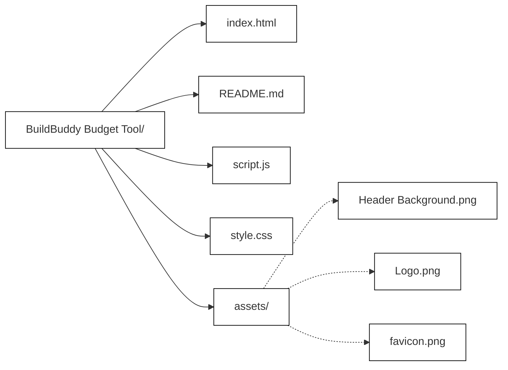

# BuildBuddy Budget Tool Coursework
 Development of the BuildBuddy Budget Tool page for my coursework evidence

**You can view the website at - https://theladeli.github.io/buildbuddy-budget-tool-coursework/**

Note, this is currently **still in development** and is being developed **mobile first**.

***

# Documentation
### Note: The following Documentation is still under works.

***

# 📒 Report

<aside>
💡 **Table of Contents**

</aside>

1. Overview of the website project: Describe the goals of the website and what it aims to achieve, tech stack.
2. Client requirements: Outline the specific requirements that the client had for the website, such as design, functionality, and content.
3. Design process: Detail the steps taken to create the website design, including wireframing, prototyping, and feedback from the client.
4. Development process: Describe the development process, including the choice of platform and programming languages, as well as any custom features or functionality that were added.
5. Content creation: Explain how the content for the website was created, including any copywriting or graphic design work that was done.
6. Testing and quality assurance: Detail the testing process used to ensure the website functions correctly, and how any issues or bugs were resolved.
7. Launch and deployment: Discuss the steps taken to launch the website and make it live, including any hosting or domain registration requirements.
8. Results and feedback: Provide data and feedback from the client and users to showcase the website's success in meeting its goals.
9. Future plans and maintenance: Outline any plans for future updates or maintenance of the website, including ongoing support and optimization.
10. Conclusion: Summarize the key takeaways from the project, including any challenges faced and lessons learned.

# 📝 Overview

---

The Budget Tool is a core feature of our all-in-one home extension app, designed to help homeowners plan, track, and manage their finances during their home extension projects. The tool is designed to be user-friendly and intuitive, with a simple layout that makes it easy for homeowners to monitor their expenses and stay on budget throughout the project.

The Budget Tool consists of three main components: a budget calculator, a budget estimator, and a specification tool integration.

The budget calculator will be a powerful tool that uses a range of data points, including the size of the extension, the type of property, and other variables, to provide an accurate estimate of the project. By using our large database of home extensions in the area, the calculator can give a realistic and reliable cost estimate.

The budget estimator is a useful tool that allows homeowners to get an average cost estimate for their project type based on their location. For example, a rear-storey extension may cost more in one area than in another due to different labour costs or building regulations, and the estimator takes this into account to give an accurate estimate.

The specification tool integration is an essential feature of the Budget Tool, as it allows homeowners to select their specifications and finishes for all spaces in their houses. By choosing specifications alongside the budget tool, homeowners can ensure that they do not forget anything, have an easy all-in-one place to store all their specification choices and make sure that they stay within budget when choosing their finishes.

The Budget Tool also takes into account the pre-build phases of a project, such as planning, surveyors, architects, and other costs associated with getting the project ready to start.

# 🛠️ Tech Stack

---

### Hosting

- GitHub

### Front-end

- HTML
- CSS
- Bootstrap (for responsive design)
- JavaScript (for interactivity and dynamic updates)

### Backend / JS Features

- Vanilla Js
- HTML5 Canvas
- Fetch API

### Design

- Figma

## Stack Breakdown

- HTML: Used for creating the basic structure and content of the web pages.
- CSS: Used for styling the web pages and making them look visually appealing.
- Bootstrap: Used for building responsive and mobile-first designs, making it easier to create a user-friendly interface. I also prefer Bootstrap for the easy grid and column layouts.
- JavaScript: Used for adding interactivity and dynamic updates to the budget tool, such as updating budget values and progress bars in real-time as users input data.
- Figma: Used for designing the UI/UX of the budget tool, creating wireframes and mockups, and ensuring a consistent visual design.
- GitHub: Used for cloud hosting, version control and branching. It also makes it a lot easier to develop from multiple devices.

# 🎯 Features

---

The Budget Tool will have a modern and user-friendly design that is easy to navigate. The design should be conscious of future categories that will be added.

The following features will be included in the Budget Tool:

### 1. Budget Estimator

The Budget Dashboard will take the results of the Budget Estimator / Calculator as a variable and use it to benchmark the users actual costs against.

### 2. Budget Overview Widget

There will be a widget at the top of the page showing an overview of the users Budget. In it will be a doughnut wheel progress bar, that updates according to the percentage of the estimated costs the actual cost has reached,

### 3. Budget Categories

Below the overview widget, all the different budget categories will be displayed with their own overview. For each category, there will be an estimated cost and actual cost displayed, so the user can easily benchmark them against each other.

### 4. Room for other category pages

I will only be developing the Shell Cost category, but I will develop having in mind other budget categories will be added. To make it easy to navigate, I’ll add a tab styled navigation menu below the overview widget.

### 5. Category Items

Within each category will be a list of relevant items which the user will be able to add prices for or use our estimated cost. For the Shell Cost category, here are the items to be added:

- Contingency
- Enabling Works
- Foundations
- Foundation Masonry
- Ground Floor
- Second Floor
- Brickworks
- Structural Works
- Roof Carpentry
- Gutters & Rainwater Pipes
- Roof Covering
- Joinery First Fix
- Flat Roofs
- Plastering & Insulation
- Plumbing First Fix
- Sundry Fixings & Fasteners

During the development of this section, I found the process of adding these items along with their estimated price and adding room for the actual price field very time-consuming. So after trying a few different methods, I decided to use JavaScript to import the items along with their prices from a CSV. This way it can easily be managed and updated. I’ll go into more detail on how I did this in the code breakdown.

### 6. Actual Costs

The actual cost fields should be constantly editable and updated in real-time. This means a user should not need to click **Save** or **Submit** anywhere in order for it to update. With this working, the wheel progress bar, totals and percentage will be able to live update in real-time with each edit.

### 7. Budget Totals

The totals for each categories estimated and actual costs will be saved inside a variable that can be displayed inside the page, for an easy benchmarking.

# 🎨 Designs

---

I made these designs using Figma. I’ve never really used Figma much until I started with the recent app mockups. I picked up a pile of really powerful features as I used it, these things really helped streamline the design process. Some of them include:

- Auto Layout
- Components
- Layout Grids
- Masking
- Prototyping
- Saved Styles

Figma also offers a few features that really helped me during the development process. These include the ability to inspect any element and get the CSS used, and also being able to export any element or group as a PNG or SVG (along with multipl other file types) in the quality you set it.

Here are the designs I made for the  a link to the Figma board with my designs:


On the left is the Budget tool homepage, in the middle is the Checklist homepage, and on the right are two elements from the screens that needs to be scrolled to fully view them. So I’ve displayed them outside of the pages so you can fully view the designs.

# 📝 Documentation & Notes

---

For my portfolio submission, I am going to be building the Budget Tool home page. This will be the page users are taken to upon completing the Budget Tool Estimator or Budget Tool Calculator. The Estimated prices will be saved to a variable, which I will use to benchmark the actual cost against.

The site will be developed for mobile use, as that is our primary target. For this submission, due to the time constraints I will not be developing the desktop view.

A while into the development of the Budget Tool page, I was struggling with a few of the more complex elements like the live updating progress wheel. So to complete this, I used ChatGPT. I will outline any segments that were assisted by ChatGPT and I will also write up an explanation of as much as I understand of the code used.

As I used ChatGPT and I wanted to submit a piece of work that was fully developed by me independently, I finished that page (as I was already a few hours into its development of it) and then proceeded to develop another page for the app.

This other page is the Home page for the Apps Checklist feature. It is mostly static, and uses HTML, CSS and JS for a few elements that include the users project details to update it on the page using DOM. 

# 🧮 Budget Tool

---

To get started, I created a new folder called **BuildBuddy Budget Tool** and created a bunch of files within it. The `index.html`, a file for the styling, the JavaScript and a folder for any assets that will be used in the code.



As always, I started the `HTML` off with some boilerplate code. In it I linked the stylesheet, JavaScript, Bootstrap and Open Graph meta info for the sharing data.

```html
<html lang="en">

<head>
    <meta charset="UTF-8">
    <meta http-equiv="X-UA-Compatible" content="IE=edge">
    <meta name="viewport" content="width=device-width, initial-scale=1.0, viewport-fit=cover">
    <title>Budget | BuildBuddy</title>
		<link rel="icon" type="image/x-icon" href="/assets/Favicon.png">

    <!-- Open Graph Social Sharing -->
    <meta property="og:title" content="Budget | BuildBuddy">
    <meta property="og:description" content="Unlock seamless budgeting for home extensions with our Budget Tool: calculator, estimator & spec integration, all in one user-friendly app! 🏠">
    <meta property="og:image" content="https://github.com/theLadEli/buildbuddy-budget-tool-coursework/blob/main/assets/Open%20Graph%20Meta%20Image.png?raw=true">

    <!-- Bootstrap -->
    <link href="https://cdn.jsdelivr.net/npm/bootstrap@5.3.0-alpha3/dist/css/bootstrap.min.css" rel="stylesheet"
        integrity="sha384-KK94CHFLLe+nY2dmCWGMq91rCGa5gtU4mk92HdvYe+M/SXH301p5ILy+dN9+nJOZ" crossorigin="anonymous">
    <script src="https://cdn.jsdelivr.net/npm/bootstrap@5.3.0-alpha3/dist/js/bootstrap.bundle.min.js"
        integrity="sha384-ENjdO4Dr2bkBIFxQpeoTz1HIcje39Wm4jDKdf19U8gI4ddQ3GYNS7NTKfAdVQSZe" crossorigin="anonymous">
    </script>

    <!-- Bootsrap Icons -->
    <link rel="stylesheet" href="https://cdn.jsdelivr.net/npm/bootstrap-icons@1.10.4/font/bootstrap-icons.css">

    <link rel="stylesheet" href="style.css">
</head>

<body>
	

	<script src="script.js"></script>
</body>
</html>
```

To get started, I added a few tags, the `<nav>`, `<footer>` and a few sections in between. Giving them all ID’s as I added them, as this would help me target each specific section when I style them.

```html
<nav>
</nav>

<section id="dashboard">
</section>

<section id="scrollable-tabs">
</section>

<section id="shell-costs">
</section>

<footer class="menu">
</footer>
```

I then linked the local font files to the CSS and added a few Global Styles.

```css
/* Font Linking */

@font-face {
    font-family: 'Aeonik';
    src: url('assets/Aeonik-Regular.ttf');
    font-weight: normal;
    font-style: normal;
}

@font-face {
    font-family: 'Aeonik';
    src: url('assets/Aeonik-Bold.ttf');
    font-weight: bold;
    font-style: normal;
}

@font-face {
    font-family: 'Aeonik';
    src: url('assets/Aeonik-Light.ttf');
    font-weight: 300;
    font-style: normal;
}

/* Global Styles */

body {
    font-family: 'Aeonik';
    background-color: #F2F2F5;
    text-align: center;
}
```

Now I was ready to start building it out, section by section.

## **📍 Header**

The header consists of a hamburger icon for the menu pullout, and the logo. It should’ve been simple enough, with just two tags needed. I used a Bootstrap icon class in an `<i>` tag for the menu icon, and an `` tag for the logo.

```html
<nav class="hero-background">
	 <i class="bi bi-list"></i>
	 
</nav>
```


To style it up a bit, I added a backgound image to the `.hero-background` class. I then centered it, set it to cover the section with no-repeat. And lastly added some padding to the section.

To get the Icon to the left of the logo with some even spacing between them, I set the `<nav>` to a relative position with display set to flex. I aligned everything center, set the conetnet to justify with space-between, added some additionl padding and set it to a fixed height of 80px.

Lastly I positioned the image, changed the sizing and then added some basic styling to the icon. Getting the grid right was pretty hard, so i did have to refer to some CSS documentation and hack it a little bit to get the logo perfectly aligned in the center, the icon on the left with even spacing and nothing on the right. I also didn’t want the icon to push the logo a bit to the right, and it worked.

```css
.hero-background {
    background: url("assets/Large\ Header\ Background.png");
    background-position: center;
    background-size: cover;
    background-repeat: no-repeat;
    padding: 20px 0;
}

nav {
    position: relative;
    display: flex;
    align-items: center;
    justify-content: space-between;
    height: 80px;
    padding: 50px 30px;
    text-align: center;
}

nav img {
    position: absolute;
    top: 50%;
    left: 50%;
    transform: translate(-50%, -50%);
    max-height: 100%;
    max-width: 170px;
}

nav i {
    font-size: 30px;
    color: white;
    margin-left: 10px;
}
```

The menu now looked like this:


## **📈 Dashboard**

### → Doughnut Wheel

The dashboard was a lot more complex than I had previously intended, so I split it into two parts. The first half is a `div` with two columns, on the left is the doughnut progress wheel, and on the right are the two costs.

```html
<div class="container">

	<div class="row">
	  <div class="col">
	    <!-- content for left column -->
	    <canvas id="doughnutWheel" width="150" height="150"></canvas>
    </div>

    <div class="col total-project-costs">
	    <!-- content for right column -->
	    <h3>Total Costs</h3>
			
			<div id="totalEstimatedCostDisplayOutside">Estimated: £0</div>
			<div id="totalActualCostDisplayOutside">Actual: £0</div>
		</div>

</div>

<p class="percentage-notice">(% of actual cost)</p>
```

For the Dougnut wheel functionality, I had originally tried multiple methods by myself. But in the end, I used Chat GPT to get it done.

```jsx
let percentageNumber = 0;

const canvas = document.getElementById('doughnutWheel');
const ctx = canvas.getContext('2d');

const userScore = Math.min(percentageNumber, 100); // Replace 62 with the actual user score value, and cap it at 100
const radius = 75;
const strokeWidth = 20;
```

The script first creates a few variables. The `percentageNumber` variable, which will represent something I called the user's score. The users score will be a percentage of the Actual Cost out of the Estimated Cost.

For the actual doughnut wheel, it used DOM to target the canvas element inside the HTML, using the ID `doughnutWheel` and creates a 2D drawing context (ctx).

The `userScore` is then set to have a minimum of the `percentageNumber` value, and a maximum of 100. This way it doesn't exceed 100, causing the canvas drawing to overlap. 

The radius and strokeWidth of the doughnut chart are also set. I didn’t want it to be a full circle, so I set a radius of `75`.

```jsx
const dpr = window.devicePixelRatio || 1;
canvas.style.width = canvas.clientWidth + 'px';
canvas.style.height = canvas.clientHeight + 'px';
canvas.width = canvas.clientWidth * dpr;
canvas.height = canvas.clientHeight * dpr;
ctx.scale(dpr, dpr);

const centerX = canvas.width / (2 * dpr);
const centerY = canvas.height / (2 * dpr);
```

As the canvas is going to be shown on many different devices, all with a different pixel ratio, I wanted to ensure it always looked sharp. To do this, it set the canvas size ased off of the device’s pixel ratio (dpr).

```jsx
ctx.clearRect(0, 0, canvas.width, canvas.height);
```

The above code snippet was something I had added a little later. I realised that for some reason, every time the userScore was updated, a new canvas be written on top of the existing canvas. So this line of code clears the existing canvas before writing the new one.

```jsx
ctx.beginPath();
ctx.arc(centerX, centerY, radius - strokeWidth / 2, 0.7 * Math.PI, 2.3 * Math.PI);
ctx.lineCap = 'round';
ctx.lineWidth = strokeWidth;
ctx.strokeStyle = '#F2F2F5';
ctx.stroke();
```

After the canvas has been cleared, it draws an empty doughnut wheel above it. I set the line ends to rounded and the colour to an off-white with the hex code of `#F2F2F5.`

```jsx
const startAngle = 0.7 * Math.PI;
const endAngle = startAngle + (1.6 * Math.PI * (userScore / 100));
```

Next, GPT gave me the above code to calculate the filled portion of the wheel. It saved the starting and ending point to two variables.

```jsx
const gradient = ctx.createLinearGradient(0, 0, 0, canvas.height);
gradient.addColorStop(0, '#6CBDC5');
gradient.addColorStop(1, '#42848A');

ctx.beginPath();
ctx.arc(centerX, centerY, radius - strokeWidth / 2, startAngle, endAngle);
ctx.lineCap = 'round';
ctx.lineWidth = strokeWidth;
ctx.strokeStyle = gradient;
ctx.stroke();
```

It then draws the filled portion with a linear gradient filling. Once again, the line ends were set to rounded, and it used the same stroke width as the unfilled wheel.

```jsx
ctx.font = '700 25px Aeonik';
ctx.textAlign = 'center';
ctx.textBaseline = 'middle';

ctx.save();
ctx.translate(centerX, centerY - 15);
ctx.fillStyle = '#5aa5ac';
ctx.fillText(`${userScore}%`, 0, 0);
ctx.restore();
```

Inside the wheel I wanted the users score shown as a number, so it set the font and alignment and then positioned it in the center and added a percentage sign after the nuber.

```jsx
ctx.font = '400 12px Aeonik';
ctx.fillStyle = '#272F3A';
ctx.fillText('Of estimated', centerX, centerY + 12); // Adjust the vertical position of the text

// Draw the "costs" text
ctx.fillText('costs', centerX, centerY + 24); // Adjust the vertical position of the text
```

To finish it, I wanted the user score text to be shown as `{userScore}% of estimated costs`. Because of the small amount of space inside the doughnut wheel, I added `costs` on a new line below the `Of estimated` text.

Beneath the two columns I added a small notice:

```html
<p class="percentage-notice">(% of actual cost)</p>
```

Now the doughnut wheel works. For the below example I called the `drawDoughnutWheel();` and gave the parameter value of  `70`:


I tried as best as I could to understand the code generated by GPT, I do understand quite a bit of it, but I don’t think I’d be able to replicate something like this on my own.

### → Horizontal Chart

Below the wheel I wanted to add the category pricing breakdown. It’d have a horizontal chart to represent each categories cost out of the entire projects total. To start, I added some text

```html
<p class="percentage-notice">(% out of actual cost)</p>
<h3>Pricing Breakdown</h3>
```

Beneath the text I added a div with the ID of `lineChart` so I can target it inside the JS and add the chart there.

```html
<div id="lineChart"></div>
```

Now I moved onto the JavaScript.

```jsx
const lineChart = document.getElementById('lineChart');
const segments = [{
    color: '#4e32af',
    percentage: 45
  },
  {
    color: '#3399fd',
    percentage: 28
  },
  {
    color: '#6cbdc5',
    percentage: 15
  },
];
```

First, I targeted the HTML div and saved it inside a variable called `lineChart`. Then I defined an array called `segments` with three objects inside it. Each object represents a different segment of the chart and has a colour and percrentage defined.

To draw the chart, I created a function called `drawLineChart()`.

```jsx
let currentOffset = 0;
```

Inside the function, I first initialised a `currentOffset` variable, this will be used to keep track of the horizontal position for each segment.

```jsx
segments.forEach((segment) => {
  const div = document.createElement('div');
  div.style.backgroundColor = segment.color;
  div.style.width = `${segment.percentage}%`;
  div.style.left = `${currentOffset}%`;
  div.classList.add('segment');
  lineChart.appendChild(div);
  currentOffset += segment.percentage;
});
```

Now using `forEach` it iterates through each segment in the `segments` array. It creates a div for each, sets the background color to the one defiined in the array, and the width to the percentage defined inside the array. It also gives it a class of `segments`, which can be used for additional styling in CSS. Lastly, it updated the `currentOffset` variable to the percentage value, so it an correctly position the next segment.

```jsx
const remainingPercentage = 100 - currentOffset;
if (remainingPercentage > 0) {
  const div = document.createElement('div');
  div.style.backgroundColor = '#ff694e';
  div.style.width = `${remainingPercentage}%`;
  div.style.left = `${currentOffset}%`;
  div.classList.add('segment');
  lineChart.appendChild(div);
}
```

As there are four categories and I want all of them togethor to take up the full width, I only created three segments and will have the rest of the space be the last segment. To get the number of the remaining space, I deducted the `currentOffset` value from 100. Finally, I added some styling as I did with the other segments.

Now that the JS was finished, there were a few small things to change using CSS.

```jsx
#lineChart {
    width: 100%;
    height: 10px;
    position: relative;
    overflow: hidden;
}

.segment {
    height: 100%;
    position: absolute;
}

.segment:first-child {
    border-top-left-radius: 10px;
    border-bottom-left-radius: 10px;
}

.segment:last-child {
    border-top-right-radius: 10px;
    border-bottom-right-radius: 10px;
}
```

I corrected the positioning of entire div, set the segments height to 100% and its’ positioning to absolute, and lastly rounded the ediges of the first and last segments.

Now it looked like this:


The horizontal chart was also assisted by GPT, as it turned out to be a lot harder then I had originally thought. But once again, I spent some time going through the code trying to understand and explain it to the best of my ability.

### → Category Breakdown

Beneath the horizontal chart, I’ll now add the category breakdowns. I found the best way to achieve the design intended would be to use a table, but with no borders or backgrounds.

```html
<table>
    <thead>
        <tr>
            <th></th>
            <th></th>
            <th>Estimated</th>
            <th><strong>Actual</strong></th>
        </tr>
    </thead>
    <tbody>

    </tbody>
</table>
```

I created a table and added a `<thead>` and `<tbody>` to it. Inside the head, I added two empty cells, and then the headers “Estimted” and “Actual”. I added the two empty cells as there will be four columns, and I only wanted the headers for the last two.

```html
<tr>
  <td><div class="color-square" style="background-color: #4e32af;"></div></td>
	<td><strong>Shell Cost</strong></td>
  <td>£1,000</td>
	<td><strong>£1,000</strong></td>
</tr>

<tr>
	<td><div class="color-square" style="background-color: #3399fd;"></div></td>
  <td><strong>Specifications</strong></td>
  <td>£1,000</td>
	<td><strong>£1,000</strong></td>
</tr>

<tr>
	<td><div class="color-square" style="background-color: #6cbdc5;"></div></td>
  <td><strong>Professionals</strong></td>
  <td>£1,000</td>
	<td><strong>£1,000</strong></td>
</tr>

<tr>
	<td><div class="color-square" style="background-color: #ff694e;"></div></td>
	<td><strong>Contingency</strong></td>
	<td>£1,000</td>
	<td><strong>£1,000</strong></td>
</tr>
```

Inside the table body, I added four rows. In each row I added the Category name, estimated cost and actual cost. I then also added a div for a small coloured square, to give a bulleted list effect, which I’ll use CSS to style.

```css
.color-square {
    width: 1em;
    height: 1em;
    display: inline-block;
    border-radius: 3px;
}
```

I just set the width and height to `1em`, set it to display inline and added a little border radius so it’s not too rough.

```css
table {
    margin-top: 15px;
    border-collapse: collapse;
    width: 100%;
}

table,
th,
td {
    border: none;
    background: transparent;
    vertical-align: middle;
    padding-top: 3px;
    padding-bottom: 3px;
}

thead th {
    text-align: left;
}

td:nth-child(1),
th:nth-child(1) {
    width: 16;
}

td:nth-child(2),
th:nth-child(2) {
    width: 40;
}

td:nth-child(3),
th:nth-child(3) {
    text-align: center;
    width: 20;
}

td:nth-child(4),
th:nth-child(4) {
    text-align: center;
    width: 20;
}
```

To make the table look more comfortable, I adding some spacing around it and between each row, set the table width to 100%, updated some alignment and then spent some time getting the column width just right.

Now it was looking much better:


### → Additional Dashboard Styling

Now that all the elements have been added to the Dashboard widget, and the JavaScript was functioning correctly, I’ll add some finishing touches to it.

```css
#dashboard {
    background-color: #ffffff;
    border-radius: 10px;
    box-shadow: 0px 6px 30px rgba(0, 0, 0, 0.06);
    padding: 20px;
    margin: 15px;
    margin-top: 30px;
}
```

Firstly, I added a white background, some border radius, box shadow and spaced it out a bit more, to really give it a widget feel.


```css
#totalEstimatedCostDisplayOutside,
#totalActualCostDisplayOutside {
    display: flex;
    flex-direction: column;
}

.total-project-costs {
    text-align: left;
}

.percentage-notice {
    font-size: 14px;
    margin-bottom: 30px;
}
```

I then aligned the total costs left, and  formatted the small percentage notice.

```css
h3 {
    font-style: normal;
    font-weight: 700;
    font-size: 20px;
    line-height: 22px;
}
```

I also added some `h3` styling to the global styling section of my CSS, and now the dashboard section is ready!


## **🗂️ Scrollable Category Tabs**

For this section, I created an outer div with the ID `scrollable-container`. Inside it I created four divs, one for each category name.

```html
<section id="scrollable-tabs">

        <div class="scrollable-container">
            <div class="scrollable-item active">Shell Cost</div>
            <div class="scrollable-item">Specifications</div>
            <div class="scrollable-item">Professional</div>
            <div class="scrollable-item">Extra's</div>
        </div>

    </section>
```

The HTML was pretty simple, but the real work was inside the CSS.

```css
#scrollable-tabs {
    margin: 15px;
    margin-top: 30px;
}

.scrollable-container {
    display: flex;
    overflow-x: auto;
    white-space: nowrap;
}
```

First, I added some spacing to it. Then I had the divs going left to right, rather than one stacked above the other.

```css
.scrollable-item {
    flex: 0 0 auto;
    width: 150px;
    margin-right: 16px;
    background-color: #f2f2f200;
    padding: 8px 35px;
    border-radius: 58px;
}

.active {
    background: #000000;
    color: #F2F2F5;
    font-weight: bold;
}
```

To give the divs a tab header effect, I set them all to the same width of `150px`, added some margin and padding, gave it a transparent background colour and lastly rounded the items by updating their border-radius.

I then targeted the class `active`, as this was given to the div that contained `Shell Cost` and as it was the selected category, I made it bold with a background colour to stand out.

```css
.scrollable-container::-webkit-scrollbar {
    display: none;
}
```

Finally, I hid the scrollbars by using `-webkit-scrollbar`.

Now, all the tab headers were showing side by side and you’re able to scroll through them by swiping.


## **💰 Shell Cost (Category)**

### → Basic Category Layout

I first started by creating a div, so I can have the category heading next to the relevant coloured square both vertically aligned nicely.

```html
<section id="shell-costs">

        <div class="shell-cost-container">
            <div class="focus-color-square" style="background-color: #4e32af;"></div>
            <h3>Shell Costs</h3>
        </div>

</section>
```

I added classes and ID’s so I can easily target the specific elements in the CSS without affecting any other items on the page.

```css
.shell-cost-container h3 {
    margin: 0;
    padding-left: 15px;
    display: inline;
}

.focus-color-square {
    width: 1.5em;
    height: 1.5em;
    display: inline-block;
    border-radius: 4px;
}

.shell-cost-container {
    display: flex;
    align-items: center;
    margin-bottom: 15px;
}

#shell-costs p {
    font-size: 14px;
}
```

For the CSS, I set the heading to inline, gave it a bit of padding and then set the styling for the coloured square. I gave the div it was wrapped in a display style of `flex` and set the paragraph to `14px`.

Now it looked like this:


It could do with improvements, like alignment and padding.

```css
#shell-costs {
    text-align: left;
    background-color: #ffffff;
    border-radius: 10px;
    box-shadow: 0px 6px 30px rgba(0, 0, 0, 0.06);
    padding: 20px;
    margin: 30px 15px;
}
```

I gave it the same widget effect as the dashboard, aligned it all left and with a few simple lines of CSS it looked much better:


### → Category Costs Table

Now for the actual category costs. Every item needs three elements:

1. Item Name
2. Estimated Cost
3. Actual Cost

The actual cost field had to be constantly editable, and the total of the actual costs should be shown on the page and live update every time one of the fields is edited. The user should not have to click “Save” or “Submit” anyhere for the totals to update. And as the doughnut wheel works off the totals, it should live update too.

This made everything a lot more complicated. Originally I had decided to code all the rows (15+) in HTML. But this would mean for evey one having to create the item name, the value developing the editable field. Adding classes for the even listeners (which will be used to calculate the totals) etc. And this would be very time consuming and be confusing to update, especially as there will be more categories added.

So after looking around for ways to do this, I thought the best way would be to import all the items along with the estimated costs from a CSV using JavaScript. It would loop through the CSV, adding all the items and values into table cells, with styling and any classes needed. It’d then also add the number fields for the Actual Costs.

But before I did all this, I got started with the general table structure.

```css
<table id="costTable">
    <thead>
        <tr>
            <th></th>
            <th>Estimated</th>
            <th><b>Actual</b></th>
        </tr>
    </thead>

    <tbody id="table-body">
    </tbody>

    <tfoot>
        <tr>
            <td class="tfoot-cell">TOTAL</td>
            <td style="font-weight: bold;">Estimated Here</td>
            <td style="font-weight: bold;">Actual Here</td>
        </tr>
    </tfoot>

    </tbody>
</table>
```

I created the `<table>` with a head and body in it. Inside the head, I added one empty cell so the other two cells are shifted to the right. In the other two header cells I gave them the value of “Estimated” and “Actual”.

I gave the body an ID of `table-body` so it can easily be targeted by the JavaScript. And for the footer I created cells for the totals to go inside.

### → CSV Import

Before I moved onto the JavaScript, I got the CSV file ready, in it I put a column header, and then the item with the price. I added the price without the £ symbol or any other formatting, as that will break the calculations. I’ll do so using JavaScript later.

```json
Item,Estimated
Contingency,5000
Enabling Works,2500
Foundations,8000
Foundation Masonry,6000
Ground Floor,10000
Second Floor,9000
Brickworks,12000
Structural Works,15000
Roof Carpentry,5000
Gutters & Rainwater Pipes,2000
Roof Covering,6000
Joinery First Fix,5000
Flat Roofs,4500
Plastering & Insulation,8000
Plumbing First Fix,6000
Sundry Fixings & Fasteners,2000
```

Inside the JavaScript I created a function called `csvToArray()`.

```jsx
function csvToArray(csv) {
  const [header, ...rows] = csv.split('\n').map(row => row.split(',').map(item => item.trim()));
  return rows.map(row => header.reduce((obj, key, i) => ({
    ...obj,
    [key]: row[i]
  }), {}));
}
```

This function takes a CSV as input and returns an array of objects where each object represents a row, and its keys are the header column names. I don’t fully understand this and had to use ChatGPT to get it done. But it seems to work, and as this was taking longer then I thought I wasn’t going to spend hours looking for an alternative.

Now to format the numbers I created another function, this one called `formatCurrency`:

```jsx
function formatCurrency(number) {
  return parseFloat(number).toLocaleString('en-GB', {
    minimumFractionDigits: 0,
    maximumFractionDigits: 0
  });
}
```

It takes numbers as input, converts it to British English and set the decimal places to none.

Now to calculate the totals estimated cost totals, I’ll create a function that can be called later on:

```jsx
function updateTotalEstimatedCost() {
  const rows = document.querySelectorAll('#table-body tr');
  let totalEstimatedCost = 0;

  rows.forEach(row => {
    totalEstimatedCost += parseFloat(row.getAttribute('data-estimated-cost'));
  });

  document.getElementById('totalEstimatedCost').textContent = `£${formatCurrency(totalEstimatedCost)}`;
}
```

This calculates the total estimated cost based off the `data-estimated-cost` attribute in each row.

```jsx
function generateTableRows(data) {
  const tbody = document.getElementById('table-body');

  data.forEach(item => {
    const tr = document.createElement('tr');
    tr.setAttribute('data-estimated-cost', item.Estimated);

    const itemName = document.createElement('td');
    const strong = document.createElement('strong');
    strong.textContent = item.Item;
    itemName.appendChild(strong);
    tr.appendChild(itemName);

    const estimatedCost = document.createElement('td');
    estimatedCost.textContent = `£${formatCurrency(item.Estimated)}`;
    tr.appendChild(estimatedCost);

    const actualCost = document.createElement('td');
    const div = document.createElement('div');
    div.classList.add('input-container');
    const span = document.createElement('span');
    span.classList.add('currency-symbol');
    span.textContent = '£';
    div.appendChild(span);
    const input = document.createElement('input');
    input.setAttribute('type', 'number');
    input.setAttribute('pattern', '[0-9]*');
    input.setAttribute('inputmode', 'numeric');
    div.appendChild(input);
    actualCost.appendChild(div);
    tr.appendChild(actualCost);

    tbody.appendChild(tr);
  });

  updateTotalEstimatedCost();
  updateTotalCosts();
}
```

Now for the function that generates the table. This takes the array of data from the CSV, generates the tables rows each with three cells and places the relevant data inside them. After doing so it calls the functions to update the Total Estimated and Total Actual costs. I’ll explain these functions later.

```jsx
async function fetchCSVandGenerateTable() {
  const response = await fetch('shell-cost.csv');
  const csv = await response.text();
  const data = csvToArray(csv);
  generateTableRows(data);
}

fetchCSVandGenerateTable();
```

Now, to call all the previous functions and actually have the table generated I created this last function that fetches the CSV, converts it to text and then to an array and lastly puts all that data into the function that generates the table.

### → Cost Calculator

For this section I’ll calculate the actual costs based off the users field input using even listeners. Then I’ll update all the relevant elements on the page and redraw the doughnut wheel.

```jsx
const totalEstimatedCostDisplay = document.querySelector('tfoot td:nth-child(2)');
const totalActualCostDisplay = document.querySelector('tfoot td:nth-child(3)');
const costTable = document.getElementById('costTable');
```

First I declared three variables, as these are elements that will be called numerous times.

I continued by creating a function called `updateTotalCosts`:

```jsx
function updateTotalCosts() {
```

This function will calculate both the total estimated and total actual costs. Then it will update the relevant divs on the HTML where the updated costs should be shown. It also updates the doughnut wheel.

```jsx
let totalEstimatedCost = 0;
let totalActualCost = 0;
```

To start, I initialised two variables. One for the total actual costs and the other for the total estimated costs.

```jsx
const rows = costTable.querySelectorAll('tbody tr');
```

Next, I targeted all the rows of the table body, and saved them to a variable called `rows`.

```jsx
rows.forEach(row => {
    const estimatedCost = parseFloat(row.getAttribute('data-estimated-cost'));
    totalEstimatedCost += estimatedCost;

    const actualCostInput = row.querySelector('input[type="number"]');
    if (actualCostInput.value) {
      totalActualCost += parseFloat(actualCostInput.value);
    }
  });
```

I don’t entirely understand the above code, it was developed with ChatGPT. The functionality of the snippet is to get all the estimated costs and add them to the Total Estimated Costs. It then does the same with the actual cost.

```jsx
const formattedEstimatedCost = `£${formatCurrency(totalEstimatedCost)}`;
const formattedActualCost = `£${formatCurrency(totalActualCost)}`;

totalEstimatedCostDisplay.innerText = formattedEstimatedCost;
totalActualCostDisplay.innerText = formattedActualCost;

document.getElementById('totalEstimatedCostDisplayOutside').textContent = `Estimated: ${formattedEstimatedCost}`;
  document.getElementById('totalActualCostDisplayOutside').textContent = `Actual: ${formattedActualCost}`;
```

After that it formats the total estimated and actual costs and saves them to a variable. Then it updates the innerText of the display elements with the formatted total costs. It does the same for the divs outside the table that will have the total costs displayed.

```jsx
const percentage = (totalActualCost / totalEstimatedCost) * 100;

percentageNumber = parseFloat(percentage.toFixed(2));

drawDoughnutWheel(percentageNumber);
}
```

Now that we’ve got the total costs, I can calculate the percentage of actual costs compared to the estimated costs. I did this in a variable called `percentage` aand then updated the `percentageNumber` variable I defined a while ago, to the actual percentage. Lastly, I redwer the dougnut wheel and closed the function.

```jsx
costTable.addEventListener('input', (event) => {
  if (event.target.tagName === 'INPUT' && event.target.type === 'number') {
    updateTotalCosts();
  }
});
```

As the actual cost fields would constantly be editable, I added eventListeners to the number fields, when a number field is changed it will call the `updateTotalCosts()` function we just created.

### → Styling the Table

Now that the cost calculator was fully functional, it was time to style it up. Now it looked like so:


The fields were overlapping off the section, the alignmentt and spacing were off and it generrelly just needed some restyling.

```css
#costTable {
    width: 100%;
    table-layout: fixed;
}
```

To start off, I set the entire table to fixed, with a width of 100%. Next, the sizing of each column needed adjusting. I wanted the first column to take up a wider amount, as there will be more text in it. The second and third column should have a similar width.

```css
#costTable th:first-child,
#costTable td:first-child {
    width: 40%;
}

#costTable th:nth-child(2),
#costTable td:nth-child(2) {
    margin-right: 20px;
    width: 20%;
    color: #57B3BD;
    text-align: center;
}

#costTable th:nth-child(3),
#costTable td:nth-child(3) {
    width: 20%;
}

#costTable th {
    font-size: 14px;
}
```

I also set the color of the Estimated Costs column to our Teal blue brand colouring, and center aligned it. Lastly, I set the table heading text size to 14px. Now that each columns size had been adjusted, I could start focusing on its contents.

```css
.input-container {
    position: relative;
    display: inline-block;
    width: 100%;
    margin-left: 5px;
}

.input-container input[type="number"] {
    padding-left: 20px;
    background: #FAFAFA;
    width: 100%;
    padding: 8px 12px;
    border: 1px solid #E6E9F0;
    border-radius: 8px;
    box-sizing: border-box;
}
```

To style up the Actual Costs input field, I set it’s position to relative, made it full width and gave it a margin left of 5px, so it had some breathing room. I then gave it padding, a background and border colour, added some border radius and it was already looking much better!


Although it was looking better, as the pound sign was above the input field, it was looking slightly off. So I added the below code:

```css
.currency-symbol {
    position: absolute;
    left: 5px;
    top: 50%;
    transform: translateY(-50%);
    font-size: 17px;
}
```

I set its position to absolute, and now it was showing inside the field, now it looked much more comfortable.


For the final polish I adjusted the bold text, and then added some seperation for the footer.

```css
#shell-costs strong {
    font-size: 14px;
    line-height: 17px;
}

.tfoot-cell {
    margin-top: 90px !important;
    padding: 15px 0;
    border-top: solid 1px #E6E9F0;
}

.spacing-div {
    height: 15px;
}

tbody tr:last-child td {
    margin-bottom: 20px;
    padding-bottom: 20px;
    box-sizing: border-box;
}
```

I gave it some padding, a top border and it was looking perfect!


## 🪧 **Menu**

The final thing to add is the Footer. This is a fairly simple section, it’s just a four-column layout with an image and link in each.

```html
<footer class="menu">
        <div class="container">
            <div class="row">

                <div class="col">
                    <!-- content for first column -->
                    
                    <a class="menu-item" href="index.html">Checklist</a>
                </div>

                <div class="col">
                    <!-- content for second column -->
                    
                    <a class="selected menu-item" href="">Budget</a>
                </div>

                <div class="col">
                    <!-- content for third column -->
                    
                    <a class="menu-item" href="">Specifications</a>
                </div>

                <div class="col">
                    <!-- content for fourth column -->
                    
                    <a class="menu-item" href="">Documents</a>
                </div>

            </div>
        </div>
    </footer>
```

I left most anchor tags unlinked, except the Checklist item, as thaat will link to the next page I’ll develop. The styling of this section took slightly longer then the HTML.

```css
footer {
    margin-top: 35px;
    width: 100%;   
    border-radius: 18px 18px 0 0;
}

.menu {
    background-color: white;
    padding: 25px 15px;
    filter: drop-shadow(0px -2px 29px rgba(0, 0, 0, 0.176));
}

.menu img {
    height: 45px;
    display: inline-block;
    padding-bottom: 10px;
}

.menu .col {
    text-align: center;
}

.menu-item {
    text-decoration: none;
    color: #A4A9B4;
    font-weight: bold;
    text-transform: uppercase;
    font-size: 9px;
}

.selected {
    color: #57B3BD;
    display: inline-block;
}

.budget-menu-item {
    display: inline-block;
}
```

I set it to full width, added some margin and curved the corners. I then added a box shadow and set its background color to white, to make it moderately stand out, but not too much. I styled the text, and gave the **Budget** item the cyan colouring, to show that it is the selected page. I then set each menu item to inline-block, and now it looked like this:


Originally I had planned on setting it to be fixed to the bottom of the page, but I didn’t want it to be a distraction to the user and take them away from the Budget flow.

# 🤔 Notes & Thoughts

---

The Budget Tool turnedd out to be a lot more complex then I had originally intended. I only realised this after I had already started the development. This was a lack of foresight on my behalf, but now I have learnt to map out projects more clearly before I start. This way I’ll get a clearer understanding of it and know my limitations before spending a few hours attempting it.

For quote a few of the JavaScript functionality, I had to use ChatGPT for assistance. I outlined where it was used, and I also spent some time trying to understand whaat it did and how the code worked. While I don’t think I could have done those bits on my own, I do have a slight understanding of it, which I tried outlining above.

As the Budget tool was not entirely developed independently, I decided I will create another page. This page will be the Checklist home page, which I’ll now proceed to explain.

# 📃 Checklist Tool

---

## **📍 Header**

Elements like the header were made a lot simpler as I had already defined the styling for the Budget page.

```html
<header>
	<div class="hero-background">

	  <nav>
        <i class="bi bi-list"></i>
        
    </nav>

    <div id="project-info">
        <h6 id="project-type">Single Storey Rear Extension</h6>
        <h2 id="project-name">Eli’s Extension</h2>
    </div>

	</div>
```

The header consisted of two sections. One section contained the hamburger menu, the logo and the user’s details. The other consisted of the actual navigation menu.

In the first section, I added the hamburger icon using bootstrap icons. Beneath that I addded a div with the `project-type` and `project-name`.

```css
.hero-background {
    background: url("assets/Large\ Header\ Background.png");
    background-position: center;
    background-size: cover;
    background-repeat: no-repeat;
    padding: 20px 0;
}

#project-info {
    margin-top: 20px;
    text-align: left;
    margin-left: 25px;
}

#project-type {
    font-family: 'Open Sans';
    font-style: normal;
    font-size: 10px;
    line-height: 16px;
    letter-spacing: 1.2;
    text-transform: uppercase;
    color: #FFFFFF;
    opacity: 60%;
}

#project-name {
    font-family: 'Aeonik';
    font-style: normal;
    font-weight: 700;
    font-size: 32px;
    line-height: 34px;
    color: #FFFFFF;
}
```

To style it up I used the same `.hero-background` styling I created before, then for the project info div, I added some margin and aligned the text left. The project type was a small `<h6>` on top of the project name, I formatted the text for that along with the `<h2>`.

Now it looked like this:


Inside the JS I wanted the project type and name to be able to source from a variable, so I removed the text inside the `<h2>` and `<h6>` and added some JavaScript:

```jsx
var projectName;
var projectType;

document.getElementById('project-name').innerText = projectName;
document.getElementById('project-type').innerText = projectType;
```

I declared two variables, these will store the project type and name upon user registration. Then I targeted the two headings and set the innerText to the value of the variables.

## 🪧 **Menu**

Below the heading I created a menu. Although it was the same menu layout as the Budget page, I made a few changes to it. As it was going to be shown inline, the height should be smaller, there should be no border radius or box shadow and I had to reduce the padding.

```html
<section id="inline-menu">
            <div class="container">

                <div class="row">
                    <div class="col">
                        
                        <a class="selected menu-item" href="">Checklist</a>
                    </div>

                    <div class="col">
                        
                        <a class="menu-item" href="budget.html">Budget</a>
                    </div>

                    <div class="col">
                        
                        <a class="menu-item" href="">Specifications</a>
                    </div>

                    <div class="col">
                        
                        <a class="menu-item" href="">Documents</a>
                    </div>
                </div>

            </div>
        </section>

    </header>
```

On this menu I changed the `selected` class to be on the Checklist item rather then the `Budget`. The CSS looked like this:

```css
#inline-menu {
    background-color: white;
    padding: 15px 15px;
}

#inline-menu img {
    height: 45px;
    display: inline-block;
    padding-bottom: 10px;
}
```

Now the menu looked like this:


## **🗂️**  Checklist Categories

The checklist categories section took me a little longer then I had thought. I was struggling to get the 3 x 2 grid structure, especially as I wanted a 15px spacing between every column and row. But eventually, along with the site [https://cssgrid-generator.netlify.app/](https://cssgrid-generator.netlify.app/), I was able to get it done.

```html
<section id="checklist-categories">

        <div class="container">
            <div class="row gy-3">
                <div class="col">
                    <div class="grid-item item-1">
                        
                        <h4>Getting Started</h4>
                        <p>8 tasks</p>
                    </div>
                </div>
                <div class="col">
                    <div class="grid-item item-2">
                        
                        <h4>Setting a Budget</h4>
                        <p>5 tasks</p>
                    </div>
                </div>
            </div>
            <div class="row gy-3">
                <div class="col">
                    <div class="grid-item item-3">
                        
                        <h4>Choosing a Builder</h4>
                        <p>10 tasks</p>
                    </div>
                </div>
                <div class="col">
                    <div class="grid-item item-4">
                        
                        <h4>Managing the Build</h4>
                        <p>21 tasks</p>
                    </div>
                </div>
            </div>
            <div class="row gy-3">
                <div class="col">
                    <div class="grid-item item-5">
                        
                        <h4>Final Checks</h4>
                        <p>5 tasks</p>
                    </div>
                </div>
                <div class="col">
                    <div class="grid-item item-6">
                        
                        <h4>Your Tasks</h4>
                        <p>View More</p>
                    </div>
                </div>
            </div>
        </div>

    </section>
```

In each grid item there was an image, an `<h4>` with the category name and a `<p>` tag that shows the number of tasks in that category. I also added a seperate class for each grid item, as I wanted each one to have a seperate coloured border to be consistent with its icon.

```jsx
#checklist-categories {
    padding: 10px 0;
}

.gy-3 {
    --bs-gutter-y: 0;
    --bs-gutter-x: 15px;
}

#checklist-categories .row {
    margin-top: 15px;
}

.grid-item {
    background-color: #fff;
    border-radius: 8px;
    padding: 15px;
    text-align: center;
    height: 135px;
    display: flex;
    flex-direction: column;
    align-items: center;
    justify-content: center;
}

.item-1 {
    border-bottom: 2px solid #ff694e;
}   

.item-2 {
    border-bottom: 2px solid #f39d4e;
}

.item-3 {
    border-bottom: 2px solid #f0c761;
}

.item-4 {
    border-bottom: 2px solid #57b3bd;
}

.item-5 {
    border-bottom: 2px solid #3399fd;
}

.item-6 {
    border-bottom: 2px solid #a485fe;
}

h4 {
    font-style: normal;
    font-weight: 700;
    font-size: 15px;
    line-height: 16px;
    color: #272F3A;
}

#checklist-categories img {
    height: 35px;
    margin-bottom: 15px;
    margin-top: 15px;
}

#checklist-categories p {
    font-family: 'Aeonik';
    font-style: normal;
    font-weight: 400;
    font-size: 12px;
    line-height: 14px;
    color: #A4A9B4;
    margin-top: 10px;
}
```

In the above CSS, I first added some padding to the top of the entire section. I then added some gutter accross the x-axis, set the border for each individual cateogry. For the text, I gave the `<h4>` a heavy font-weight, I added some line height, set its colour and  size. For the paragraph tag, I made it smaller and give it some margin, along with some typical paragraph CSS. Lastly, I sized down the image and gave it some further margin.

Now it looked like this:


## 📞 Speak to an Expert Callout

The final thing to add was the Speak to an Expert Callout. It was 

```html
<section id="expert-consultation">

        <div class="container text-center">
            <div class="row">
                <div class="col-8 col-left">
                    <h2>Schedule a FREE consultation with an Extension Expert.</h2>
                </div>

                <div class="col-4">.
                    
                </div>
            </div>
        </div>

    </section>
```

The HTML was just a simple two columned section, one column was set to much wider then the other. In the left column I added an `<h2>`, and in the right column I added an `` tag.

```jsx
#expert-consultation {
    background: radial-gradient(71.79% 1273.44% at 85.89% 32.35%, #4DB3BE 0%, #5EC5D0 100%);
    text-align: left;
    margin: 15px;
    border-radius: 8px;
    padding: 15px 15px 10px 15px;
}

#expert-consultation h2 {
    font-family: 'Aeonik';
    font-style: normal;
    font-weight: 400;
    font-size: 20px;
    line-height: 25px;
    color: #FFFFFF;
}

#expert-consultation img {
    width: 120%;
    margin-top: -15px;
}

#expert-consultation .row {
    display: flex;
    align-items: center;
}

.col-left {
    text-align: left;
}
```

Had I not used Figma to design this, I would have struggled with the sections gradient background. But as Figma had a feature to just be able to copy the CSS for any selected element, I was ale to easily set its gradient-based off the design. I added some padding and margin, changed the `<h2>` styling a bit, making sure I was only targeting the `<h2>` specific to this section.

I enlarged the image a bit and reduced the spacing above it, then I set the alignment for both columns and I was finally finished!


I added two screenshots above as you have to scroll a bit to see the entire page.

# 🤔 Notes & Thoughts

---

This page took much quicker then the Budget page as it didn’t contain much JavaScript. I find that I do need to get more comfortable with advanced JavaScript as it will definately come in handy often and will let me develop way more advanced websites.

Had I known I was going to be developing two pages when I started, I would have done the CSS pretty differently. As it is using the same stylesheet for both pages, a lot of styling is duplicated just targeting different classes, one class for each page. I also would have defined many more global styles, I just didn’t think this was needed originally.

Overall, I definately learnt and realised a lot from this project and will be keeping these things in mind before any future coding.
